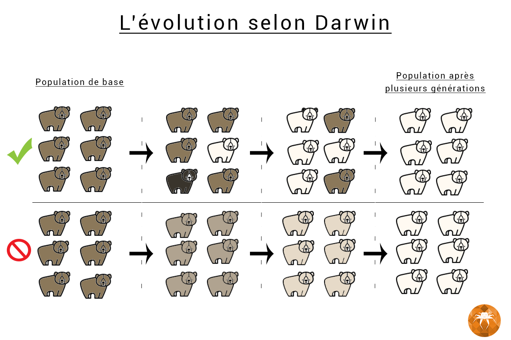

# Algorithme Génétique

## Présentation du Projet ARE24 
Notre projet d’ARE Dynamic vise à explorer l’évolution des populations d’animaux, en mettant en œuvre un algorithme génétique. Nous nous concentrons sur deux espèces : le lièvre et le lynx. L’objectif est de comprendre comment le lièvre s’adapte face au lynx, en **observant leur temps de survie en fonction de caractéristiques aléatoires**.

  

**L’algorithme génétique** simule le processus de **sélection naturelle**, où les individus les mieux adaptés ont plus de chances de survivre et de se reproduire. Nous espérons ainsi mieux appréhender la dynamique de ces populations et les mécanismes qui influencent leur évolution.

## Présentation de l'équipe

<table>
    <tr>
        <td>Francesca GIAMMARI</td>
        <td>Nassim BAYOU</td>
        <td>Menad ACHERIOU</td>
        <td>Juba YAHIAOUI</td>
    </tr>
</table>

## Sujet étudié 

**L'algorithme génétique** est une méthode de recherche heuristique inspirée par **le processus de sélection naturelle et la génétique**. Cette méthode est utilisée pour trouver **des solutions approximatives à des problèmes d'optimisation et de recherche**.

Dans l'algorithme génétique, une population de candidats est choisie afin d’évolué vers une solution. Chaque candidat a un ensemble de propriétés qui peuvent être mutées et altérées. L'évolution se produit généralement de la manière suivante :

- **La sélection** : Les individus sont sélectionnés en fonction de leur aptitude ou de leur capacité à résoudre le problème.
- **Le croisement** : Les individus sélectionnés sont croisés pour créer une nouvelle génération. 
- **La mutation** : Les nouveaux individus subissent des mutations aléatoires.
  
L'algorithme se répète avec la nouvelle génération, en sélectionnant, en croisant et en mutant jusqu'à ce qu'une solution satisfaisante soit trouvée ou qu'un certain nombre de générations soient passées.

**La sélection naturelle** est un processus fondamental de **l'évolution**, proposé par **Charles Darwin**. Elle repose sur **trois principes** clés : 

- **Hérédité** : La plupart des traits sont transmis des parents à la progéniture.
- **Surproduction** : Il y a plus de descendants que ce que leur environnement peut supporter, ce qui entraîne une compétition¹.
- **Variabilité** : Les variations des traits qui entraîneront des taux de survie et de reproduction différents parmi la progéniture.
  
Dans ce processus, certains individus d'une population ont des caractéristiques qui les rendent plus aptes à survivre et à se reproduire dans leur environnement spécifique. Ces individus ont donc plus de chances de transmettre ces traits avantageux à leurs descendants.

Par exemple, si dans une population de lapins bruns habitant une région froide et enneigée, apparaît par mutation un lapin blanc, sa couleur lui permettra de passer inaperçu et d'échapper à ses prédateurs. S’il s’accouple et a des petits, il leur transmettra sa mutation génétique et avec elle la couleur blanche. Ses descendants auront eux aussi une plus grande chance de survie et d'avoir des petits à leur tour.
Au fil du temps, ces traits avantageux deviennent plus courants dans la population, conduisant à une évolution des espèces. C'est ainsi que la sélection naturelle favorise la continuité  des formes de vie les plus adaptées à leur environnement.

On s’est donc poser comme problématique : Comment appliquer un modèle génétique sur un programme informatique ?

## Représentation du Modèle 

Notre modèle d'algorithme génétique simule la sélection naturelle en utilisant une population de lièvres et de lynx. On étudiera également les caractéristiques qui optimisent les chances de survie des lièvres dans un environnement où les lynx sont les prédateurs.

**Objectif :** Modéliser la sélection naturelle avec un algorithme génétique et pouvoir déterminer comment les caractéristiques des lièvres affectent leur survie.

On a utilisé différentes caractéristiques qui peuvent varier d'un animal à un autre :

Les lièvres peuvent avoir différentes taille, ce qui peut affecter leur capacité à échapper aux prédateurs et à accéder à la nourriture.

La vitesse des lièvres varient également. Elle détermine leur capacité à se déplacer rapidement dans leur environnement pour échapper aux lynx.

Chaque lièvre a une intelligence qui l'influencera sur ses décisions de déplacement. Les animaux les plus intelligents sont capables de prendre des décisions plus adaptées à leur survie comme par exemple pourvoir prendre une direction poyr esquiver un lynx et éviter de se faire manger.

La vision des lièvres détermine leur capacité à détecter les prédateurs à proximité et à trouver de la nourriture.

La caractéristique de la faim poussera les lièvres à chercher de la nourriture pour survivre plus longtemps. Une faim non satisfaite peut réduire leur espérance de vie.

Le temps critique indique le moment où les lièvres commencent à être en danger de mourir de faim. Ainsi ils vont prendre le risque d'aller chercher de la nourriture même si cela met leur vie en danger. Par exemple si un lièvre est dans un temps critique et qu'il y a de la nourriture dans sa direction mais également un lynx, il ira chercher quand même la nourriture.

Chaque lièvre possède une durée de vie qui détermine combien de temps ils peuvent survivre dans leur environnement.

**Dans cet environnement :**
La taille de l'environnement est fixe.
On introduit ensuite des lièvres et des lynx, ainsi que de la nourriture, dans notre cas des carottes.
Le temps s'écoule au fur et à mesure que la simulation progresse avec des les paramètres vus ci dessus comme la faim ou le temps critique qui affectent la survie des lièvres.

**Mécanisme de l'algorithme :**

Au début de la simulation nous commençons par créer une population initiale de lièvres avec des caractéristiques aléatoires.
Les animaux se déplacent dans l'environnement en suivant des mouvements prédéfinis. Les lièvres tentent d'éviter les lynx, de trouver de la nourriture pour prolonger leur durée de vie et de survivre aussi longtemps de possible.
Chaque animal est évalué en fonction de sa capacité à survivre dans l'environnement.
Ensuite les lièvres les mieux adaptés sont sélectionnés pour se reproduire et transmettre leurs caractéristiques à la génération suivante.
Les caractéristiques des lièvres sélectionnés sont combinées par croisement, et des mutations aléatoires peuvent survenir pour introduire de la diversité génétique.
Finalement une nouvelle génération est créée à partir des animaux sélectionnés avec des caractéristiques améliorées pour une meilleure adaptation à l'environnement.

Nous analyserons les résultats pour comprendre les caractéristiques les plus cruciales pour la survie des lièvres.

  

 

## La Simulation du Modèle

Voici des vidéos représentant l'évolution des lièves face aux lynx :
 - Vidéo représentant les premières minutes d'une simulation sur longue durée
   
   <video src="images./Début.mp4" width="750" height="500" controls="" preload=""></video>
   
 - Vidéo représentant 1h de simulation sur longue durée
   
   <video src="images./Middle.mp4" width="750" height="500" controls="" preload=""></video>
   
- Vidéo représentant les dernières minutes d'une simulation sur longue durée

   <video src="images./Fin.mp4" width="750" height="500" controls="" preload=""></video>

- Lien vers le programme complet : <a href="https://github.com/are-dynamic-2024-g4/algo-genetique/blob/main/programme%20algo.py"> C'est ici ! </a>

## Analyse des résultats 

## Analyse critique de notre Modèle

## Perspectives et Conclusion

## Lien vers la page du blog : <a href="https://are-dynamic-2024-g4.github.io/algo-genetique/blog"> C'est ici !</a>

## Bibliographie :

- Voici le lien permettant d'acceder à notre :<a href="https://www.canva.com/design/DAGD96BfMX4/j1EUFjnG8ZxN9ZBf03KOMQ/view?utm_content=DAGD96BfMX4&utm_campaign=designshare&utm_medium=link&utm_source=editor"> Présentation PDF de notre projet</a>
- Vous pouvez trouver ici le lien permettant de comprendre de manière accentué l' <a href="https://fr.wikipedia.org/wiki/Algorithme_g%C3%A9n%C3%A9tique#:~:text=Les%20algorithmes%20g%C3%A9n%C3%A9tiques%20appartiennent%20%C3%A0,r%C3%A9soudre%20en%20un%20temps%20raisonnable.">Algorithme Génétique</a>
- Voici l'une des sources ayant permis à la compréhension de <a href="https://inventwithpython.com/makinggames.pdf">Pygames</a> suivit de <a href="https://www.youtube.com/@quietfart9591"> Quiertfart</a> qui nous a permi de de comprendre en vidéo les différents points de pygames. 

